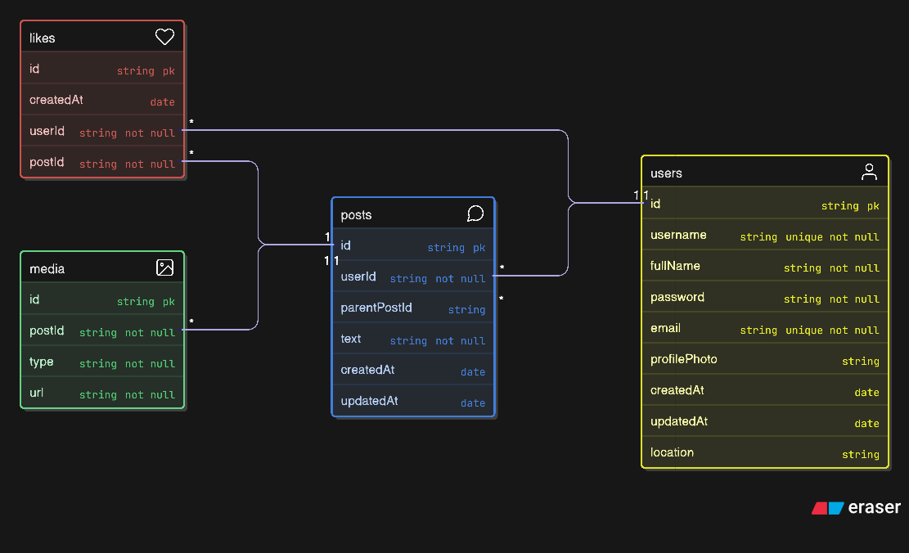

# 🌐 Social Network Backend

A robust and scalable RESTful API built with **Node.js**, **Express**, and **TypeScript**, serving as the backbone for the Social Network application. It handles authentication, user management, posts, interactions, and media uploads with a clean, layered architecture.

## 🚀 Technologies & Tools

- **Runtime**: [Node.js](https://nodejs.org/) (v20+)
- **Framework**: [Express.js](https://expressjs.com/) (v5)
- **Language**: [TypeScript](https://www.typescriptlang.org/)
- **Database**: [MongoDB](https://www.mongodb.com/) (via [Mongoose](https://mongoosejs.com/) ORM)
- **Authentication**: [JWT](https://jwt.io/) (JSON Web Tokens) & Google OAuth
- **Media Storage**: [Cloudinary](https://cloudinary.com/)
- **Documentation**: [Swagger UI](https://swagger.io/tools/swagger-ui/)
- **Logging**: Morgan

## 📂 Project Architecture

The project follows a **layered architecture** to separate concerns, ensuring maintainability and scalability.

```
src/
├── 📂 config/        # Configuration files (DB connection, Cloudinary, etc.)
├── 📂 controllers/   # Request handlers & business logic
├── 📂 middlewares/   # Custom Express middlewares (Auth, Error handling, Multer)
├── 📂 models/        # Mongoose schemas & data models
├── 📂 routes/        # API route definitions
├── 📂 types/         # TypeScript type definitions and interfaces
├── 📂 utils/         # Helper functions and utilities
└── app.ts            # App entry point
```

src/
├── 📂 config/ # Configuration files (DB connection, Cloudinary, etc.)
├── 📂 controllers/ # Request handlers & business logic
├── 📂 middlewares/ # Custom Express middlewares (Auth, Error handling, Multer)
├── 📂 models/ # Mongoose schemas & data models
├── 📂 routes/ # API route definitions
├── 📂 types/ # TypeScript type definitions and interfaces
├── 📂 utils/ # Helper functions and utilities
└── app.ts # App entry point

````

## 📊 Entity Relationship Diagram (ERD)

The following diagram illustrates the data models and their relationships within our MongoDB database. Although MongoDB is NoSQL, we maintain structured references for data integrity.



### 🔗 Relationships Breakdown

-   **Users ↔ Posts (1:N)**: A **User** can create multiple **Posts**. Each post stores a reference to its author's `userId`.
-   **Users ↔ Likes (1:N)**: A **User** can like multiple posts.
-   **Posts ↔ Likes (1:N)**: A **Post** can receive multiple **Likes**. The `likes` collection serves as a join table linking `userId` and `postId`.
-   **Posts ↔ Media (1:N)**: A **Post** can have multiple attached **Media** items (images/videos).
-   **Posts ↔ Posts (Self-Referencing 1:N)**: A **Post** can be a reply to another post (Comment/Thread), referenced via `parentPostId`.


## 🛠️ Installation & Setup

### Prerequisites

Ensure you have the following installed:

- **Node.js** (v18 or higher)
- **pnpm** (Recommended package manager) or npm/yarn
- **MongoDB** (Local or Atlas Cluster)

### 1. Clone the repository

```bash
git clone https://github.com/aracenasosa/social-network.git
cd social-network/backend
````

### 2. Install Dependencies

```bash
pnpm install
```

### 3. Environment Configuration

Create a `.env` file in the root directory and configure the following variables.

> **Note**: Never commit your actual `.env` file to version control.

```env
# Server Configuration
PORT=4000
NODE_ENV=development

# Database
MONGODB_URI=mongodb+srv://<user>:<password>@<cluster>.mongodb.net/?appName=<app_name>

# Security (JWT)
ACCESS_TOKEN_SECRET=your_super_secret_access_key
REFRESH_TOKEN_SECRET=your_super_secret_refresh_key
ACCESS_TOKEN_EXPIRES=15m
REFRESH_TOKEN_EXPIRES=7d

# Third-Party Services
# Cloudinary (Image Uploads)
CLOUDINARY_CLOUD_NAME=your_cloud_name
CLOUDINARY_API_KEY=your_api_key
CLOUDINARY_API_SECRET=your_api_secret

# Google OAuth
GOOGLE_CLIENT_ID=your_google_client_id
GOOGLE_CLIENT_SECRET=your_google_client_secret
```

### 4. Running the Server

**Development Mode** (with hot-reload):

```bash
pnpm dev
```

**Production Build**:

```bash
pnpm build
pnpm start
```

## 📡 API Documentation

The API Documentation is auto-generated using **Swagger**.

Once the server is running, visit:
**`http://localhost:4000/api/docs`**

### Main Endpoints

| Resource   | Base Path               | Description                                 |
| :--------- | :---------------------- | :------------------------------------------ |
| **Auth**   | `/api/auth`             | Login, Signup, Google Auth, Refresh Token   |
| **Users**  | `/api/users`            | Profile management, Search, Follow/Unfollow |
| **Posts**  | `/api/posts`            | Create, Read, Delete posts, Feed generation |
| **Likes**  | `/api/likes`            | Like/Unlike functionality                   |
| **Thread** | `/api/posts/:id/thread` | Fetch post thread with recursive replies    |

#### Thread Sorting

The thread endpoint supports a `sort` query parameter to control the order of replies:

- `?sort=top` (Default): Sorts by engagement (Likes + Replies count) descending.
- `?sort=recent`: Sorts by creation date descending.

## 🛡️ Key Practices & Patterns

### 🏗️ SOLID Principles

The codebase is designed with SOLID principles in mind to ensure maintainability and scalability:

- **Single Responsibility Principle (SRP)**: Each controller, model, and middleware has a distinct and isolated responsibility.
- **Open/Closed Principle (OCP)**: The architecture allows for extending functionality (e.g., adding new middlewares or routes) without modifying existing core logic.
- **Interface Segregation Principle (ISP)**: TypeScript interfaces are specific and not bloated, ensuring components only depend on what they use.

### 🔐 Authentication Architecture (JWT + Cookies)

We implement a robust **Access & Refresh Token** strategy for secure and seamless authentication:

1.  **Access Token**: Short-lived (15m), used for Authorization headers.
2.  **Refresh Token**: Long-lived (7d), stored securely in an **HTTPOnly Cookie**.
3.  **Token Rotation**: On every refresh, _both_ tokens are rotated to prevent replay attacks.
4.  **Security**:
    - Refresh tokens are stored in the database (hashed) to allow for revocation (remote logout).
    - The `HttpOnly` flag prevents XSS attacks from stealing the refresh token.

### Other Patterns

- **Type Safety**: Extensive use of TypeScript interfaces and types for reliable code.
- **Controller-Service Pattern**: Business logic is structured to be separable from validation and routing.
- **Error Handling**: Centralized error middleware to catch and format exceptions consistently.
- **Validation**: Input validation via Mongoose and custom checks ensures data integrity.

## 🤝 Contributing

1.  Fork the repository
2.  Create your feature branch (`git checkout -b feature/AmazingFeature`)
3.  Commit your changes (`git commit -m 'Add some AmazingFeature'`)
4.  Push to the branch (`git push origin feature/AmazingFeature`)
5.  Open a Pull Request
